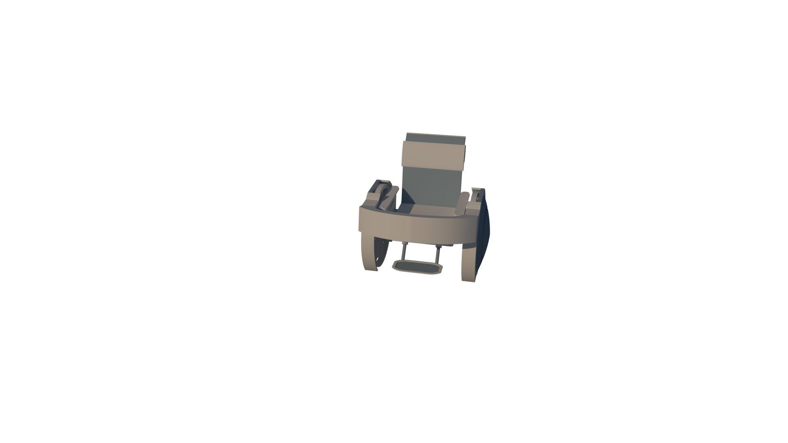

# 360 Pins Image

# DEMO

http://qifu.l-360pin-lib.surge.sh/

# How to use

```
<head>...</head>
<body>

        ...
        ...
       <!-- Set a parent Container to include all degree images -->
        <div id="image-wrapper">
            <!-- Set the default image to show e.g. default image "./whill/0.png" -->
            
        </div>
        ...
        ...

        <!-- import 360pins js file -->
        <script src="http://qifu.l-360pin-lib.surge.sh/360pin.min.js"></script>
        <script>
            const config = {

                <!-- parent wrapper DOM -->
                $img_wrapper: document.getElementById("image-wrapper"),

                 <!-- default image DOM -->
                $first_display_img: document.getElementById(
                    "first-display-img"
                ),

                <!-- relative path to img src folder -->
                srcFolder: "./whill",

                <!-- total number of images -->
                totalImgNum: 36,
            };

          <!-- set up 360pins config and init ! -->
            const fullviewer = new FullViewer(config);
            fullviewer.init();
        </script>
        ...
        ...
        ...
    </body>
```
